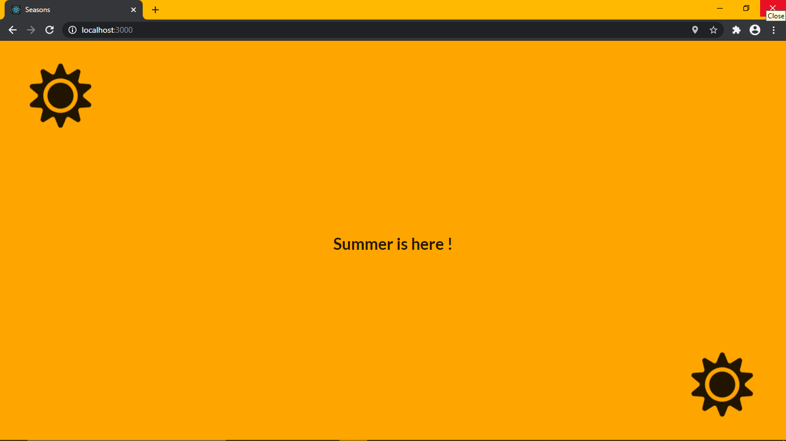

# Seasons Web App

[](https://reactjs.org/) 
[](https://code.visualstudio.com/)

This application tells you weather its winter or summer depending upon the latitude of your area.

## `How to Run ?`

```
cd Seasons      
npm install
npm start
```

The App will be available at http://localhost:3000

## `Project Screenshots`

<br>

<center>


<hr>


</center>

## `Contact`

Email - shubhamaniket6@gmail.com

LinkedIn - https://linkedin.com/in/shubhamaniket


